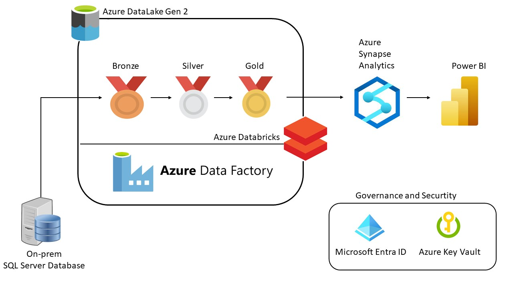

  

# Dang Van Tuan - A Data Engineering Portfolio
## About Me

**Based:** Hanoi, Vietnam

Feel Free to Connect with me 🤠

**Zalo:** 0963063230

**Email:** vantuan1362002@gmail.com

**Linkedin**: [LinkedIn](https://www.linkedin.com/in/mikezxc136/)
## Portfolio Projects

### Table of Contents

## [Sale Azure Analytics.](https://github.com/mikezxc136/sale-azure)
This project showcases the creation and execution of a comprehensive data pipeline, utilizing Azure services for data manipulation, storage, and visualization within an analytics framework.

## [Movie recommend data pipeline with Azure.](https://github.com/mikezxc136/movie-recommendation-pipeline-azure)
This project provides a hands-on experience of building a complete data pipeline using Azure services and implementing a machine learning model for movie recommendations. It is an excellent opportunity for me to understand the practical aspects of data engineering and machine learning.

